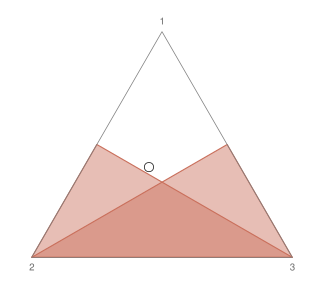
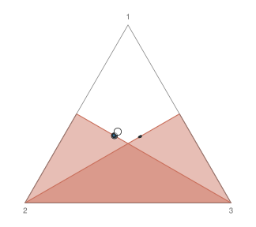
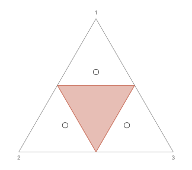
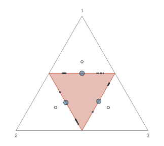

<!-- README.md is generated from README.Rmd. Edit the .Rmd and run devtools::build_readme(). -->

# ripr

`ripr` computes reverse information projections onto nulls that take the
form of a union of convex parts, and then proves an upper bound on the
expectation over the null of whatever random variable you get. The
projection is fitted via Li–Barron ([Li and Barron
1999](#ref-LiBarron1999)), Frank–Wolfe ([Jaggi 2013](#ref-Jaggi2013))
and/or EM. Bounds on the null expectation are proved by a branch and
bound algorithm (currently only for multinomial via the Bernstein
enclosure). At the end, you get a random variable that is genuinely an
e-variable for the respective null.

The idea it rests on is simpler than the reverse information projection
itself. For any non-negative, bounded random variable `X`, and `b` is
any number at least `sup_{theta in Theta_0} E_theta[X]`, then `X / b`
has null expectation at most one; i.e. `E = X / b` is an e-variable.
Nothing requires `X` to be the true minimiser of KL divergence. **This
means that we need not fit the projection exactly:** any approximation
can be used so long as we correct the resulting likelihood ratio to
yield a valid e-variable, and the quality of the approximation
determines only how much e-power survives the correction. That splits a
hard, non-convex optimisation problem into an easy one (approximate) and
a proof (bound), and it this is what `ripr` facilitates.

## Installation

``` r
# install.packages("remotes")
remotes::install_github("fleverest/ripr")
```

## Approximate, then correct

Take a three-category multinomial distribution (with `n = 20`) and the
plurality null: candidate 1 does not win outright,
`H0 = union_j {theta : theta_1 <= theta_j}`. This null can be written as
a union of convex parts; one region where `theta_1 <= theta_2` and
another where `theta_1 <= theta_3`.

``` r
library(ripr)

K <- 3L
n <- 20L
family <- multinomial_family(n_trials = n, k = K)

plurality <- null_model(
  family,
  lapply(2:K, function(j) {
    # The two sub-simplices: one for each part.
    vertices <- diag(K)
    vertices[, 1L] <- replace(numeric(K), c(1L, j), 0.5)
    simplex_region(vertices = vertices)
  })
)
```

We nominate a discrete mixture-multinomial distribution, in this case
the mixing measure is just a single dirac at `q = (0.40, 0.35, 0.25)`,
yielding a simple `Multinomial(20, q)` alternative.

``` r
Q <- family(c(0.40, 0.35, 0.25))
```

<div class="figure" style="text-align: center">


<p class="caption">

Plurality null, with the support of the alternative mixing distribution
W1.
</p>

</div>

The two parts overlap, and the alternative sits in the cap above them
where candidate 1 leads. The fitting procedure is implemented as a
sequence of steps: `fw_step` for Frank–Wolfe updates and `em_step` for
EM (also `lb_step` for Li–Barron, but not recommended). Here we
demonstrate running 40 steps of a Frank–Wolfe procedure. After running
Frank–Wolfe, `ripr_finish` can be used to solve the weights, and remove
any low-mass atoms.

``` r
set.seed(1)
state <- ripr_init(Q, plurality)
state <- fw_step(
  state,
  times = 40L,
  record_gap = TRUE,
  until = gap_below(1e-10)
)
fit <- ripr_finish(state, reoptimise = TRUE, identify = TRUE, record_gap = TRUE)

c(kl = fit$kl, gap = fit$gap_final, atoms = n_atoms(fit$W0))
#>           kl          gap        atoms 
#> 2.824752e-02 1.342453e-04 3.000000e+01
```

<div class="figure" style="text-align: center">


<p class="caption">

Plurality null, with the support of the mixing distributions W1
(alternative) and W0 (null, fitted).
</p>

</div>

The fit projection attains a KL divergence (from `Q`) of approximately
0.0282. The `gap` quanitty corresponds to an estimate of the Frank–Wolfe
duality gap, which at the true value bounds the expectation of the ratio
`Q / P*` over the null by `1 + gap`. However, our `gap` estimate here is
not an upper bound on the true quantity, so it can not be used directly
to obtain a certified e-value.

With our fit projection, we may construct a `random_variable` that
computes the mixture likelihood ratio `Q / P*`, i.e. our candidate
e-variable:

``` r
X <- likelihood(Q, label = "Q") /
  likelihood(fit$P_star, label = "P*")
X
#> <random_variable> Q / P* 
#>   on count_space, dimension 3
```

`random_variable`s are effectively functions that map elements of the
sample space to their realisation:

``` r
outcomes <- rbind(
  c(10L, 10L, 0L),
  c(8L, 7L, 5L)
)
X(outcomes)
#> [1] 0.8470669 1.0779197
```

Finally, we may use `certify()` to prove an upper bound on the null
expectation. It returns a proven upper bound alongside the largest value
the search actually attained, and the two bracket the true upper bound
which is generally unknown:

``` r
cert <- certify(X, plurality, tol = 1e-9)
c(
  upper = cert$sup_ub,
  attained = cert$sup_lb,
  width = cert$sup_ub - cert$sup_lb
)
#>        upper     attained        width 
#> 1.000134e+00 1.000134e+00 5.655212e-10
```

The bound lands just above one: it precisely bounds `1 + gap`, with
`gap` the *true* Frank–Wolfe duality gap that the fit stopped on.

``` r
c(bound_minus_one = cert$sup_ub - 1, fitted_gap = fit$gap_final)
#> bound_minus_one      fitted_gap 
#>    0.0001342459    0.0001342453
```

The re-scaled random variable `E = X / cert$sup_ub` is then a genuine
e-variable for `plurality`:

``` r
E <- X / cert$sup_ub
print(E)
#> <random_variable> Q / P* / 1.000134 
#>   on count_space, dimension 3
print(E(outcomes))
#> [1] 0.8469532 1.0777750
```

### The correction does not need a good fit

Replace the projection with something that is not the RIPr at all and
certify the resulting ratio:

``` r
bad <- family(rep(1 / K, K))
X_bad <- likelihood(Q, label = "Q") /
  likelihood(bad, label = "P0")
cert_bad <- certify(X_bad, plurality, tol = 1e-9)

c(good = cert$sup_ub, bad = cert_bad$sup_ub)
#>      good       bad 
#>  1.000134 10.545094
```

Both rescale to valid e-variables. The important quality that
differentiates them is e-power, i.e. log-growth: the expected log
e-value under the alternative, which is what compounds over a sequential
procedure. We could measure growth as follows.

``` r
growth <- function(E, Q) {
  outcomes <- enumerate_space(E@sample_space)
  e_values <- E(outcomes)
  Q_expectation <- log_density(Q, outcomes) |>
    exp() %*%
    log(e_values)
  c(Q_expectation) # return as scalar
}

E_gr <- growth(E, Q)

c(good = E_gr, bad = growth(X_bad / cert_bad$sup_ub, Q))
#>        good         bad 
#>  0.02811329 -1.99396747
```

A negative growth rate means that we lose evidence on average even when
the alternative is true: useless, but not invalid. **Validity is free
from the certification and correction procedure; while fitting a good
approximation buys e-power.**

### How close to optimal is `E`?

When `P*` is the true reverse information projection of `Q` onto `null`,
the attained KL divergence `KL(Q || P*)` is precisely the growth-rate of
the resulting e-variable `Q / P*`. For any fitted `P`, the KL divergence
is above the optimum, so the final kl divergence of the fit upper bounds
the optimal KL, and thus the optimal growth-rate. Our e-variable will
not be growth-rate optimal unless it is the true minimiser. Therefore we
know the optimum growth-rate will lie somewhere in the interval between
`growth(E, Q)` and `fit$kl` (provided `fit$kl` is not an estimate,
e.g. via Monte Carlo):

``` r
c(
  lower = E_gr,
  upper = fit$kl,
  width = fit$kl - E_gr
)
#>        lower        upper        width 
#> 0.0281132881 0.0282475250 0.0001342369
```

## A different multinomial null

Consider the null `H0: theta_1, theta_2, theta_3 <= 1 / 2`, i.e. no
category holds an outright majority (exceeds a proportion of `1 / 2`).
This forms the medial triangle in the 2-simplex. We nominate a discrete
mixture alternative with one dirac per section in the alternative,
equally weighted.

``` r
medial <- null_model(
  family,
  list(simplex_region(
    vertices = cbind(c(0.5, 0.5, 0), c(0.5, 0, 0.5), c(0, 0.5, 0.5))
  ))
)

W_maj <- finite_mixing(
  components = cbind(
    c(0.6, 0.2, 0.2),
    c(0.2, 0.6, 0.2),
    c(0.2, 0.2, 0.6)
  ),
  weights = c(1 / 3, 1 / 3, 1 / 3)
)
Q_maj <- family(W_maj)
```

<div class="figure" style="text-align: center">


<p class="caption">

Medial-triangle null, with the support of W_maj.
</p>

</div>

Here we demonstrate a slightly more elegant fitting procedure here that
interleaves Frank–Wolfe and EM steps:

``` r
hybrid_step <- function(state, times) {
  for (iter in seq_len(times)) {
    state <- state |> fw_step() |> em_step()
  }
  state
}

set.seed(2)
fit_medial <- ripr_init(Q_maj, medial) |>
  hybrid_step(times = 40L) |>
  ripr_finish(
    reoptimise = TRUE,
    identify = TRUE,
    record_gap = TRUE
  )
X_medial <- likelihood(Q_maj, label = "Q") /
  likelihood(fit_medial$P_star, label = "P*")

c(kl = fit_medial$kl, upper = certify(X_medial, medial, tol = 1e-9)$sup_ub)
#>        kl     upper 
#> 0.3845766 1.0007049
```

<div class="figure" style="text-align: center">


<p class="caption">

Medial-triangle null, with the support of W_maj and W0 (fitted).
</p>

</div>

## Searching for a supremum is not the same as proving a bound

`sup_lb()` hunts for the largest null expectation by multi-start
gradient ascent. It is much cheaper than proving a bound, and it works
on families and geometries that may not have an implemented bounding
procedure, but it is **not** a certificate. It reports what it found; a
lower bound on the supremum. Something larger may sit somewhere
difficult to reach via gradient ascent.

``` r
c(searched = sup_lb(X, plurality)$sup_lb, certified = cert$sup_ub)
#>  searched certified 
#>  1.000077  1.000134
```

Where no bounding method has been implemented, `certify()` refuses:

``` r
gaussian <- gaussian_family(dim = 2L)
null <- null_model(
  gaussian,
  list(halfspace_region(normal = c(1, -1), offset = 0))
)
Y <- likelihood(gaussian(c(0, 0)))
certify(Y, null)
#> Error:
#> ! Cannot certify:
#> No bounding method is implemented for gaussian_family expectations over halfspace_region.
#> Certifying this requires deriving and implementing a bound on gaussian_family expectations over halfspace_region. Nothing here says one does not exist. In the meantime, `sup_lb()` still searches, and reports a lower bound.
```

## References

`ripr` targets the growth-rate optimal e-variable of safe testing
([Grünwald et al. 2024](#ref-GrunwaldDeHeideKoolen2024)), approximating
its reverse information projection via the numeraire characterisation of
Larsson et al. ([2025](#ref-LarssonRamdasRuf2025)). Certified bounds use
the branch-and-bound scheme of Leroy ([2012](#ref-Leroy2012)), the
simplicial Bernstein range enclosure of Garloff
([1985](#ref-Garloff1986)), and the subdivision techniques of Prautzsch
et al. ([2002](#ref-PrautzschBoehmPaluszny2002)) (chapters 10–11).

<div id="refs" class="references csl-bib-body hanging-indent">

<div id="ref-Garloff1986" class="csl-entry">

Garloff, Jürgen. 1985. “Convergent Bounds for the Range of Multivariate
Polynomials.” *International Symposium on Interval Mathematics*, 37–56.

</div>

<div id="ref-GrunwaldDeHeideKoolen2024" class="csl-entry">

Grünwald, Peter, Rianne de Heide, and Wouter Koolen. 2024. “Safe
Testing.” *Journal of the Royal Statistical Society Series B:
Statistical Methodology* 86 (5): 1091–128.

</div>

<div id="ref-Jaggi2013" class="csl-entry">

Jaggi, Martin. 2013. “Revisiting Frank-Wolfe: Projection-Free Sparse
Convex Optimization.” *International Conference on Machine Learning*,
427–35.

</div>

<div id="ref-LarssonRamdasRuf2025" class="csl-entry">

Larsson, Martin, Aaditya Ramdas, and Johannes Ruf. 2025. “The Numeraire
e-Variable and Reverse Information Projection.” *The Annals of
Statistics* 53 (3): 1015–43. <https://doi.org/10.1214/24-AOS2487>.

</div>

<div id="ref-Leroy2012" class="csl-entry">

Leroy, Richard. 2012. “Convergence Under Subdivision and Complexity of
Polynomial Minimization in the Simplicial Bernstein Basis.” *Reliable
Computing* 17: 11–21.

</div>

<div id="ref-LiBarron1999" class="csl-entry">

Li, Jonathan, and Andrew Barron. 1999. “Mixture Density Estimation.”
*Advances in Neural Information Processing Systems* 12.

</div>

<div id="ref-PrautzschBoehmPaluszny2002" class="csl-entry">

Prautzsch, Hartmut, Wolfgang Boehm, and Marco Paluszny. 2002. *Bézier
and b-Spline Techniques*. Vol. 6. Springer.
<https://doi.org/10.1007/978-3-662-04919-8>.

</div>

</div>
