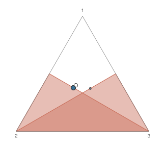

<!-- README.md is generated from README.Rmd. Edit the .Rmd and run devtools::build_readme(). -->

# ripr

`ripr` computes reverse information projections onto nulls that take the
form of a union of convex parts, and then proves an upper bound on the
expectation over the null of whatever random variable you get. The
projection is fitted via Frank–Wolfe ([Jaggi 2013](#ref-Jaggi2013))
and/or EM; bounds are proved by a branch-and-bound algorithm (currently
for multinomial families, via the Bernstein enclosure of Garloff
([1985](#ref-Garloff1986)) and Leroy ([2012](#ref-Leroy2012))). At the
end, you get a random variable that is genuinely an e-variable for the
null.

Fitting and certification are deliberately separate: **any** approximate
projection can be rescaled (by an upper bound on the expectation over
the null) to get a valid e-variable. This way, a very difficult,
non-convex optimisation problem splits into two easier problems:
approximate a distribution, then compute a bound. The better the fit,
the higher the e-power, and validity is guaranteed.

## Installation

``` r
# install.packages("remotes")
remotes::install_github("fleverest/ripr")
```

## The usual workflow

Take a three-category multinomial distribution (`n = 20` samples) and
the plurality null: candidate 1 does not win outright,
`H0 = union_j {theta : theta_1 <= theta_j}`. This null is a union of two
convex parts, so it’s built with `|`:

``` r
library(ripr)

K <- 3L
n <- 20L
family <- multinomial_family(n_trials = n, k = K)

# Defines {theta : theta_1 <= theta_j}
plurality_part <- function(j) {
  vertices <- diag(K)
  vertices[1L, ] <- replace(numeric(K), c(1L, j), 0.5)
  simplex_region(vertices = vertices)
}

plurality <- null_model(
  family,
  plurality_part(2) | plurality_part(3)
)
```

We nominate a discrete mixture-multinomial alternative (here a single
dirac at `q = (0.40, 0.35, 0.25)`), so `Q` is just `Multinomial(20, q)`:

``` r
Q <- family(c(0.40, 0.35, 0.25))
```

Fitting is a sequence of step verbs: `fw_step()` for Frank–Wolfe,
`em_step()` for EM. Here we run Frank–Wolfe for 40 iterations, then
`ripr_finish()` solves the weights and drops any low-mass atoms:

``` r
set.seed(1)
state <- ripr_init(Q, plurality)
state <- fw_step(state, times = 40L, until = gap_below(1e-10))
fit <- ripr_finish(state, reoptimise = TRUE, identify = TRUE, record_gap = TRUE)

c(kl = fit@kl, gap = fit@gap_final, atoms = n_atoms(fit@W0))
#>           kl          gap        atoms 
#> 2.822214e-02 3.347356e-05 5.000000e+00
```

<div class="figure" style="text-align: center">


<p class="caption">

Plurality null, with the support of the alternative mixing distribution
W1 and the fitted null mixture W0.
</p>

</div>

The fit gives a candidate e-variable: the mixture likelihood ratio
`Q / P*`. `random_variable`s are callable, mapping outcomes to their
realisation:

``` r
X <- likelihood(Q, label = "Q") /
  likelihood(fit@P_star, label = "P*")

outcomes <- rbind(
  c(10L, 10L, 0L),
  c(8L, 7L, 5L)
)
X(outcomes)
#> [1] 0.8366127 1.0796031
```

`certify()` proves an upper bound on expectation of `X` over the null,
including a lower-bound that is the largest value the search actually
attained:

``` r
cert <- certify(X, plurality, tol = 1e-9)
cert
#> <ripr_certificate>
#>   X = Q / P*
#>   under null_model: multinomial_family over 2 parts
#>   sup E[X] <= 1.000033  (certified, by bernstein)
#>   sup E[X] >= 1.000033  (attained; gap 9.93e-10)
#>             bound attained iterations converged
#>   part 1 1.000000 1.000000         28      TRUE
#>   part 2 1.000033 1.000033         30      TRUE
#>   e_variable(): X / 1.000033
```

Rescaling by the upper bound turns `X` into a bona fide e-variable for
the `plurality` null, which is what `e_variable()` does with a
certificate:

``` r
E <- e_variable(cert)
print(E)
#> <random_variable> Q / P* / 1.000033 
#>   on count_space, dimension 3
print(E(outcomes))
#> [1] 0.8365847 1.0795670
```

## Learn more

`vignette("ripr")` walks through the same example in more depth: why
validity survives a deliberately bad fit, how a bound from `certify()`
differs from `sup_lb()`, and what happens when no certification method
exists for a family/geometry pair. `vignette("regions")` covers the
region interface and set algebra (`|`, `&`, `-`, `==` and `disjoin()`)
used to build nulls out of convex pieces.

## References

<div id="refs" class="references csl-bib-body hanging-indent">

<div id="ref-Garloff1986" class="csl-entry">

Garloff, Jürgen. 1985. “Convergent Bounds for the Range of Multivariate
Polynomials.” *International Symposium on Interval Mathematics*, 37–56.

</div>

<div id="ref-Jaggi2013" class="csl-entry">

Jaggi, Martin. 2013. “Revisiting Frank-Wolfe: Projection-Free Sparse
Convex Optimization.” *International Conference on Machine Learning*,
427–35.

</div>

<div id="ref-Leroy2012" class="csl-entry">

Leroy, Richard. 2012. “Convergence Under Subdivision and Complexity of
Polynomial Minimization in the Simplicial Bernstein Basis.” *Reliable
Computing* 17: 11–21.

</div>

</div>
